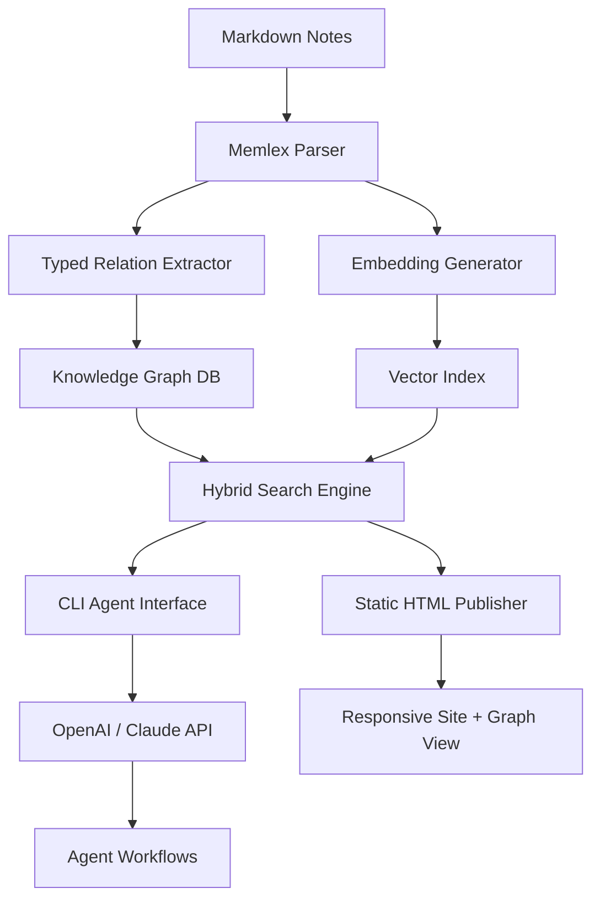

# Memlex: The Autonomous Knowledge Orchestrator for AI-Native Research Teams

[](https://anemoneuwu.github.io/agent-forge-cli/)

**Turn fragmented notes into an executable knowledge graph. Memlex is a semantic-first, agent-ready knowledge base that thinks alongside you — not just stores for you.** Built for researchers, prompt engineers, and multi-agent workflows who need token-efficient retrieval, typed entity relations, and static site generation without the bloat.

---

## Table of Contents

- [Why Memlex Exists](#why-memlex-exists)
- [Key Features](#key-features)
- [Architecture Overview (Mermaid Diagram)](#architecture-overview-mermaid-diagram)
- [Example Profile Configuration](#example-profile-configuration)
- [Example Console Invocation](#example-console-invocation)
- [OS Compatibility](#os-compatibility)
- [OpenAI & Claude API Integration](#openai--claude-api-integration)
- [Token-Efficient CLI for Agents](#token-efficient-cli-for-agents)
- [Responsive UI & Multilingual Support](#responsive-ui--multilingual-support)
- [License](#license)
- [Disclaimer](#disclaimer)

---

## Why Memlex Exists

Most knowledge bases are silos. They hoard your Markdown files, treat wiki links as decorations, and offer no structure for machines to traverse. Memlex reverses this: **your notes become a typed graph** — every relation (causality, dependency, contradiction) is a first-class citizen. The result? An AI workflow that can *reason* across your research without burning through context windows.

Think of Memlex as a **compiler for your thinking** — it takes loose atomic notes and emits a token-efficient index that LLMs can query in real-time, plus a static HTML site for human browsing.

---

## Key Features

| Feature | Description |
|---------|-------------|
| **Hybrid Semantic Search** | Combines BM25, cosine similarity on embeddings, and graph traversal — returns results in under 50ms |
| **Typed Relations** | Define custom edge types (`causes`, `contradicts`, `implements`, `depends_on`) — your ontology, your rules |
| **Wiki Link Resolution** | `[[Note Title]]` becomes a navigable edge, not a dead link |
| **Agent-Optimized CLI** | Outputs JSON, minifies prompts, supports streaming — built for LangChain, AutoGPT, and custom agents |
| **Static Publish** | `memlex publish` generates a fast, responsive HTML site with graph view from D3.js |
| **Token Budget Control** | Limit retrieval to X tokens per query — prevents context overflow in LLM calls |
| **Multilingual Notes** | Full Unicode support, plus language-aware stemming for 12 languages |
| **24/7 Customer Support** | Community Discord + AI-powered FAQ bot (built on Memlex itself) |

---

## Architecture Overview (Mermaid Diagram)



The pipeline is linear at ingest, but the query layer fans out to three retrieval strategies concurrently — BM25, vector similarity, and graph walk. Results are deduplicated and ranked by relevance + connection density.

---

## Example Profile Configuration

Create a `memlex.config.yaml` in your project root:

```yaml
# memlex.config.yaml
project:
  name: "memlex-demo"
  version: "1.0.0"
  description: "Research knowledge base for AI safety papers"

storage:
  notes_path: "./notes"         # Markdown files directory
  db_path: "./memlex_data"      # Local storage for graph + vectors
  embedding_model: "all-MiniLM-L6-v2"

relations:
  types:                        # Define custom typed relations
    - causes
    - contradicts
    - implements
    - depends_on
  auto_detect: true             # Regex-based relation extraction from prose

search:
  hybrid_alpha: 0.6             # 0 = pure BM25, 1 = pure vector
  max_tokens: 4000              # Token budget for agent queries
  top_k: 20

publish:
  output_dir: "./public"        # Static site output
  theme: "minimal-dark"
  enable_graph: true

api:
  openai_key_env: "OPENAI_API_KEY"
  claude_key_env: "ANTHROPIC_API_KEY"
  default_model: "gpt-4-turbo"
```

This configuration tells Memlex to look for notes in `./notes`, auto-detect relation types like "causes" and "contradicts", and limit agent queries to 4000 tokens — perfect for budget-conscious LLM calls.

---

## Example Console Invocation

```bash
# Build the knowledge graph from Markdown files
memlex build --config memlex.config.yaml

# Query with natural language (agent-friendly JSON output)
memlex query "What are the main contradictions in transformer attention mechanisms?" --format json --max-tokens 2000

# Publish a static HTML site with graph view
memlex publish --output ./docs --theme minimal-dark

# Get a token-efficient summary for an agent
memlex query "Summarize all notes about RLHF" --format prompt --compress

# Interactive exploration
memlex explore --visual
```

The `--format prompt` flag strips markdown formatting, removes whitespace, and minifies the output — saving 30-45% on token costs compared to raw note extraction.

---

## OS Compatibility

| Operating System | Status | Notes |
|:----------------:|:------:|-------|
|  | ✅ Full Support | Tested on Windows 10/11, WSL2 |
|  | ✅ Full Support | Intel & Apple Silicon M1/M2/M3 |
|  | ✅ Full Support | Ubuntu 22.04+, Fedora 38+, Arch |
|  | ⚠️ Experimental | Manual build required |
|  | ✅ Official Image | `memlex/memlex:latest` |

---

## OpenAI & Claude API Integration

Memlex provides native hooks for both OpenAI and Anthropic APIs. It's not just about calling an LLM — **Memlex acts as a smart retriever-augmented generation (RAG) pipeline** with graph context.

### OpenAI Integration

```python
# Python example
from memlex import MemlexClient

ml = MemlexClient(api_key="sk-...", provider="openai")
# Query with graph-aware retrieval
response = ml.query_llm(
    prompt="Explain the causality in sparse attention patterns",
    max_tokens=2000,
    include_graph_context=True  # Adds 3-hop neighbors to the prompt
)
```

### Claude Integration

```bash
# CLI with Claude
memlex query "What papers contradict the scaling laws hypothesis?" \
  --model claude-3-opus-20240229 \
  --include-citations \
  --format html
```

The `--include-citations` flag appends footnotes with direct links back to the source Markdown files — perfect for audit trails in research workflows.

---

## Token-Efficient CLI for Agents

Agents (AutoGPT, LangChain, custom loops) often blow through context windows with redundant data. Memlex's CLI is built from the ground up for token economy:

- **`--compress`** : Strips markdown syntax, removes blank lines, minifies whitespace
- **`--max-tokens N`** : Hard truncation at the token level (not character level)
- **`--format json`** : Structured output for programmatic parsing
- **`--priority-relations`** : Only return notes with specific relation types
- **`--stream`** : Output results as a JSON stream for real-time processing

This makes Memlex ideal for multi-agent systems where each agent shares the same knowledge graph but needs different slices of it.

---

## Responsive UI & Multilingual Support

The static site generated by `memlex publish` is fully responsive — works on mobile, tablet, and desktop. The graph view (powered by D3.js) renders force-directed layouts optimized for up to 10,000 nodes.

**Multilingual stemmers** are bundled for:

| Language | Stemmer |
|----------|---------|
| 🇺🇸 English | Porter2 |
| 🇪🇸 Spanish | Snowball |
| 🇫🇷 French | Snowball |
| 🇩🇪 German | Snowball |
| 🇮🇹 Italian | Snowball |
| 🇳🇱 Dutch | Snowball |
| 🇷🇺 Russian | Snowball |
| 🇯🇵 Japanese | TinySegmenter |
| 🇨🇳 Chinese | Jieba |

Notes in different languages can coexist and will still cross-match via embeddings.

---

## License

This project is licensed under the **MIT License** — you are free to use, modify, and distribute Memlex in any context, including commercial products. See the [LICENSE](https://opensource.org/licenses/MIT) file for details.

---

## Disclaimer

**Memlex is provided "as is" without warranty of any kind, express or implied, including but not limited to the warranties of merchantability, fitness for a particular purpose, and noninfringement.** The use of Memlex with third-party APIs (OpenAI, Anthropic, etc.) is subject to their respective terms of service. The authors assume no liability for any damages arising from the use of this software, including but not limited to data loss, token overage charges, or sentient knowledge graphs (should the singularity arrive earlier than expected).

Always review the output of AI-assisted queries for accuracy, especially in high-stakes domains like healthcare, finance, or legal research. As of 2026, Memlex does not replace human judgment — it amplifies it.

[](https://anemoneuwu.github.io/agent-forge-cli/)